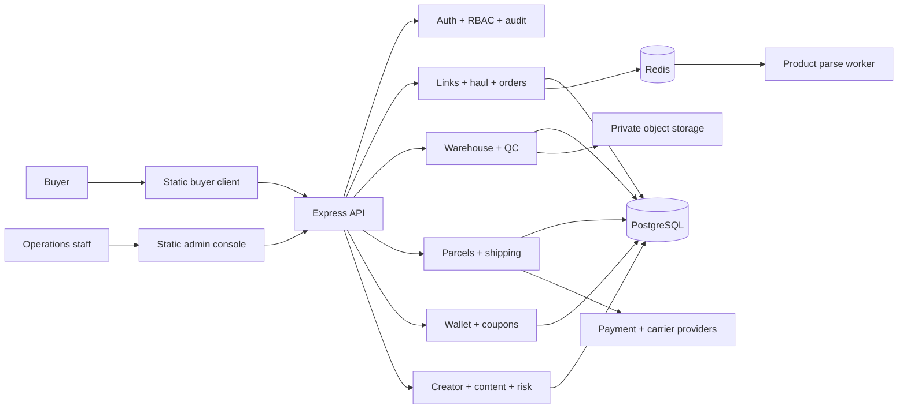

# GOATEDBUY Engineering Handoff

Last updated: 2026-07-09  
Repository: <https://github.com/AaronYu94/gxxtxxbuy>  
Branch: `main`

## 1. Executive Summary

GOATEDBUY currently has:

- A responsive buyer-facing static frontend.
- A separate internal admin console.
- A Node.js/Express backend covering B0-B8 domain foundations.
- PostgreSQL migrations, Redis queue integration, authentication, RBAC, audit logging, QC, shipping, wallet, creator/content/risk modules, and operational runbooks.
- GitHub Actions for backend CI and GitHub Pages deployment.
- A public frontend preview at <https://aaronyu94.github.io/gxxtxxbuy/>.

The public site is a frontend preview, not a fully live production service. The production API and managed infrastructure have not been deployed. Marketplace parsing currently uses a deterministic placeholder source rather than real Taobao/1688/Weidian supplier data.

## 2. Current Release State

| Area | State | Notes |
| --- | --- | --- |
| Buyer frontend | Deployed | GitHub Pages root URL |
| Admin frontend | Deployed | `/admin.html`; requires a live API for real operations |
| Backend source | Implemented and tested | Not deployed to a public production host |
| PostgreSQL | Schema and migrations ready | Managed production instance not provisioned |
| Redis | Queue adapter and worker ready | Managed production instance not provisioned |
| QC media | Local private-storage adapter ready | Production object storage not connected |
| Product parsing | Contract, worker, tests ready | Placeholder data source must be replaced |
| Payments | Domain flow and signed webhook contract ready | External payment processor not connected |
| Shipping/tracking | Quote, parcel, status, and tracking domain ready | Carrier/aggregator integration not connected |
| Monitoring/backup | Runbooks and scripts ready | Production services and alert destinations not configured |

### Public URLs

- Buyer client: <https://aaronyu94.github.io/gxxtxxbuy/>
- Admin console: <https://aaronyu94.github.io/gxxtxxbuy/admin.html>
- Surface switcher: <https://aaronyu94.github.io/gxxtxxbuy/portal.html>
- Repository: <https://github.com/AaronYu94/gxxtxxbuy>

### Last Published Commits

- `52920cc` - Update Pages actions runtime
- `4821dd0` - Document architecture and deploy frontend to Pages
- `6113470` - Complete GOATEDBUY client and parsing workflow

The working tree was clean when this handoff was generated.

## 3. System Architecture



### Architectural Boundaries

- `app/` is a framework-free static frontend and can be deployed independently.
- `backend/src/app.js` composes middleware, repositories, services, and HTTP routes.
- Domain modules own business transitions; route handlers should remain thin.
- PostgreSQL is the durable source of truth.
- Redis handles asynchronous parsing work.
- Private QC media must never be served as a public bucket; clients receive short-lived signed URLs.
- Buyer ownership checks and admin RBAC are backend responsibilities, regardless of frontend visibility.

## 4. Main Repository Map

| Path | Purpose |
| --- | --- |
| `README.md` | Main architecture and local-development overview |
| `app/client.html` | Buyer application shell |
| `app/app.js` | Buyer views, state, API adapter, and interactions |
| `app/admin.html` | Admin application shell |
| `app/admin.js` | Admin API adapter and operations views |
| `app/styles.css` | Shared responsive design system |
| `app/assets/` | Brand, hero, mascot, and payment assets |
| `backend/src/app.js` | Backend composition root |
| `backend/src/core/` | Links, haul, orders, policies, and history |
| `backend/src/auth/` | Authentication, sessions, RBAC, and audit |
| `backend/src/warehouse/` | Receiving, weight, QC, and storage |
| `backend/src/shipping/` | Quotes, parcels, payments, and tracking |
| `backend/src/wallet/` | Wallet, coupons, locks, and adjustments |
| `backend/src/parsing/` | URL recognition and product-source adapter |
| `backend/migrations/` | PostgreSQL migration history |
| `backend/tests/` | API and domain regression tests |
| `backend/deploy/production/` | Production checks and runbooks |
| `.github/workflows/backend-ci.yml` | Backend CI |
| `.github/workflows/pages.yml` | GitHub Pages deployment |

## 5. Implemented User Journey

The homepage communicates six core stages:

1. Search and Match.
2. Pay for Goods.
3. Order Reception and Transfer.
4. Quality Check and Warehousing.
5. Submit International Shipping.
6. Efficient Management.

Buyer functionality includes product-link intake, haul management, orders, QC review, forwarding, shipping quotes/parcels, wallet/coupons, affiliate views, and help content.

Admin functionality includes permission-scoped queues for procurement, warehouse/QC, shipping, wallet operations, policy management, creator/content moderation, risk cases, and audit-aware state changes.

## 6. Validation Baseline

Run the complete backend gate:

```bash
cd backend
npm run ci
```

Last result:

- Syntax check: 109 files passed.
- OpenAPI: 3.1.0 document with 64 paths passed.
- Tests: 53 passed, 0 failed.
- Build check: passed.
- Backend GitHub Action: passed.
- Pages GitHub Action: passed.
- Public buyer, admin, portal, CSS, JavaScript, and hero assets returned HTTP `200`.

## 7. Local Startup

Frontend:

```bash
cd /path/to/gxxtxxbuy
python3 -m http.server 8080 --bind 127.0.0.1
```

Open:

```text
http://127.0.0.1:8080/app/
http://127.0.0.1:8080/app/client.html
http://127.0.0.1:8080/app/admin.html
```

Backend:

```bash
cd backend
npm install
cp .env.example .env
npm run dev
```

Full local dependencies:

```bash
cd backend
docker compose up --build
```

Default local endpoints:

- API: `http://127.0.0.1:3000`
- PostgreSQL: `127.0.0.1:5433`
- Redis: `127.0.0.1:6380`

## 8. Production Configuration

Do not commit production secrets.

Required production categories include:

- `DATABASE_URL`
- `REDIS_URL`
- storage driver, bucket, public API base, and signing secret
- shipping webhook secret
- CORS origins
- database readiness flags and pool limits
- feature flags for payments, shipping, coupons, and creators
- welcome-gift and risk-automation configuration

Use:

```bash
cd backend
npm run env:check
npm run migrate:dry-run
npm run db:backup
```

The frontend reads `window.GOATEDBUY_API_BASE_URL` before falling back to `http://127.0.0.1:3000`. Production deployment must:

1. Generate an untracked `config.js` containing the HTTPS API origin.
2. Load `config.js` before `app.js` and `admin.js`.
3. Add `https://aaronyu94.github.io` or the final custom domain to backend CORS.
4. Never expose backend secrets in the static frontend.

See `backend/deploy/production/frontend-config.md`.

## 9. Known Gaps

### P0: Required Before Real Users

- Deploy the backend API to a public HTTPS container host or VM.
- Provision managed PostgreSQL and Redis.
- Run and verify production migrations.
- Connect private object storage for QC media.
- Inject the production API URL into the Pages build.
- Replace local-development secrets and pass `npm run env:check`.
- Run production smoke tests and the P0 security regression checklist.
- Configure logs, uptime checks, alerts, backups, and rollback ownership.

### P1: Required Before Real Transactions

- Replace `createPlaceholderProductSource()` with a legal, reliable marketplace data provider.
- Integrate a real payment processor and map provider events to the existing signed webhook contract.
- Integrate shipping quotes, labels, and tracking with a carrier aggregator.
- Add real email/SMS/in-app notifications for order, QC, payment, and tracking events.
- Complete finance reconciliation and refund operations.

### P2: Product Hardening

- Add browser end-to-end tests for critical buyer and admin flows.
- Add production analytics and conversion/error funnels.
- Replace remaining placeholder support/community destinations with owned URLs.
- Perform accessibility, localization, and content/legal review.
- Add a custom domain and production privacy/terms pages.

## 10. Recommended Next Execution Order

1. Choose backend, database, Redis, and object-storage providers.
2. Create staging infrastructure first.
3. Configure staging secrets and run `env:check`.
4. Run backup and migration dry-run.
5. Deploy API and product-parse worker.
6. Connect staging frontend via generated `config.js`.
7. Run `npm run smoke` plus manual buyer/admin acceptance.
8. Replace placeholder marketplace parsing.
9. Integrate payment and carrier providers in sandbox mode.
10. Promote the verified release to production using the rollback runbook.

## 11. Operational Guardrails

- Do not bypass ownership checks or RBAC for frontend convenience.
- Do not make the QC object bucket public.
- Do not run destructive migrations without a current restore-tested backup.
- Do not enable risk automation until thresholds and review ownership are approved.
- Keep payment, shipping, coupon, and creator kill switches independently operable.
- Preserve idempotency for purchase, payment, webhook, coupon, and parcel transitions.
- Treat the deployed admin HTML as public code; all authorization must remain server-side.

## 12. Definition of the Next Milestone

The next milestone is complete when:

- Staging API `/health` and `/ready` are healthy.
- PostgreSQL, Redis, storage, API, and worker are connected.
- Pages uses the staging API without exposing secrets.
- A buyer can register, submit a link, complete item details, create an order, review QC, create a parcel, and observe tracking.
- An authorized operator can process the corresponding admin workflow.
- Smoke, security, backup/restore, monitoring, and rollback checks all pass.

At that point, the project moves from a deployed frontend preview plus tested backend codebase to an end-to-end staging system.
