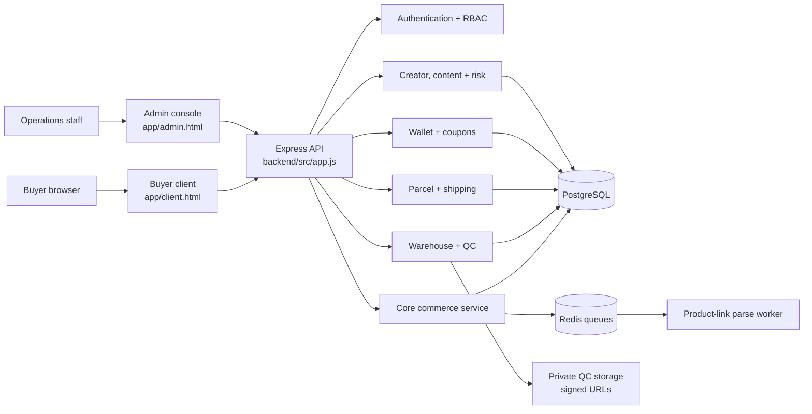

# GOATEDBUY

GOATEDBUY is a China shopping-agent and international parcel-forwarding platform. It separates the buyer experience, internal operations console, and backend API while keeping the full order journey visible:

`Search product -> Pay for goods -> Purchase and transfer -> QC and warehouse -> International shipping -> Order management`

## Live Frontend

- Buyer client: <https://aaronyu94.github.io/gxxtxxbuy/>
- Admin console: <https://aaronyu94.github.io/gxxtxxbuy/admin.html>
- Surface switcher: <https://aaronyu94.github.io/gxxtxxbuy/portal.html>

GitHub Pages hosts static frontend files only. Live login, orders, QC, wallet, and shipping data require a separately deployed backend API.

## Architecture



### Frontend

The frontend is framework-free HTML, CSS, and JavaScript so it can be hosted on any static platform.

- `app/client.html` and `app/app.js`: buyer workflow, product-link intake, forwarding, QC, shipping, wallet, affiliate, and help-center views.
- `app/admin.html` and `app/admin.js`: permission-scoped operations console for procurement, warehouse, shipping, policy, wallet, content, and risk work.
- `app/styles.css`: shared responsive design system.
- `app/assets/`: brand, hero, mascot, and payment assets.
- `app/config.js` and `app/config.example.js`: validated public runtime API, locale, and display-currency configuration for each environment.

The buyer account routes use live, ownership-scoped API data. Session credentials are tab-scoped in `sessionStorage`; profile and address PII is not persisted by the frontend.

### Backend

The backend is a Node.js 22 and Express 5 service organized by business capability:

- `backend/src/app.js`: HTTP composition, middleware, routes, and dependency wiring.
- `backend/src/auth/`: buyer/admin identity, email and device verification, sessions, password handling, TOTP, and RBAC.
- `backend/src/account/`: versioned profiles, multi-address ownership/default rules, deletion eligibility, and asynchronous anonymization.
- `backend/src/core/`: links, haul items, purchase orders, policies, and order history.
- `backend/src/warehouse/`: receiving, weight, QC photos, approval, and storage deadlines.
- `backend/src/shipping/`: shipping lines, quotes, parcels, payments, webhooks, and tracking.
- `backend/src/wallet/`: balances, transactions, coupons, and checkout locks.
- `backend/src/creators/`, `content/`, `risk/`, and `country/`: platform growth and governance features.
- `backend/src/parsing/`: marketplace recognition and product-link extraction.
- `backend/migrations/`: PostgreSQL schema history.

The service uses repository interfaces with PostgreSQL implementations in production and in-memory implementations in tests. Redis handles asynchronous work such as product parsing. External side effects use idempotency checks, legal status transitions, audit records, and permission gates.

## Request Flow

1. A buyer submits a marketplace URL from Taobao, 1688, Weidian, Yupoo, or another supplier.
2. The API validates ownership and deduplicates the link.
3. Product metadata is parsed inline for development or queued through Redis for a worker in production.
4. The buyer confirms specifications and creates a purchase order.
5. Operations receives the item, records weight, and uploads 3-5 private QC photos.
6. The buyer approves items, combines a parcel, compares shipping routes, and pays.
7. Signed webhooks settle payment, while tracking events update the buyer workspace.

## Security Boundaries

- Buyer and admin sessions are separate.
- Every private resource is ownership-scoped or permission-scoped.
- Admin capabilities use role-based access control and audit logging.
- QC images are private and exposed through short-lived signed URLs.
- Payment webhooks are signed and deduplicated.
- Secrets stay in environment variables and are never committed.
- Feature flags can disable payments, shipping, coupons, creators, and risk automation independently.

## Local Development

Frontend:

```bash
python3 -m http.server 8080 --bind 127.0.0.1
```

Open <http://127.0.0.1:8080/app/>.

Backend:

```bash
cd backend
npm install
cp .env.example .env
npm run dev
```

The API defaults to <http://127.0.0.1:3000>. PostgreSQL and Redis can be started with:

```bash
cd backend
docker compose up --build
```

## Validation

```bash
cd backend
npm run ci
```

The CI pipeline runs syntax linting, OpenAPI validation, 68 backend/frontend-foundation tests, and a build check. GitHub Actions runs the same backend checks and deploys `app/` to GitHub Pages after changes reach `main`.

## Deployment Model

| Surface | Recommended host | Requirement |
| --- | --- | --- |
| Static frontend | GitHub Pages | Public repository and Pages workflow |
| Backend API | Container host or VM | Node.js 22, secrets, HTTPS |
| Database | Managed PostgreSQL | Backups and migration access |
| Queue | Managed Redis | Worker connectivity |
| QC media | Private object storage | Signed URL support |

Production frontend configuration should provide a public `window.GOATEDBUY_CONFIG` object based on `app/config.example.js`, set `apiBaseUrl` to the HTTPS API origin, and add the Pages/custom-domain origin to backend CORS. Never put credentials or signing secrets in this static object.

## More Documentation

- [PRD V2.0 atomic tasks](PRD_V2_开发原子任务.md)
- [PRD V2.0 interactive checklist](prd-v2-checklist.html)
- [V2-00 frozen baseline](V2-00_需求冻结与现状基线/README.md)
- [Frontend notes](app/README.md)
- [Backend API and operations](backend/README.md)
- [Production deployment runbook](backend/deploy/production/README.md)
